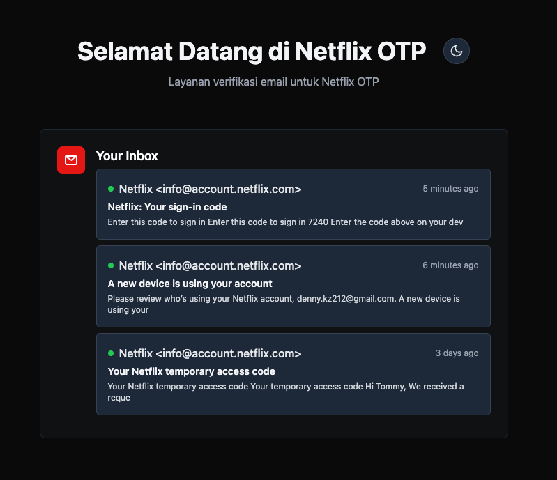

## Preview

   

## Netflix OTP — IMAP Email Reader (singkat)

Aplikasi Laravel kecil untuk membaca email melalui IMAP dan mengekstrak link / PIN yang dikirim oleh Netflix.

Ringkas:

- Tujuan: otomatis membaca pesan dari folder `NETFLIX` dan mengambil link/PIN verifikasi Netflix.
- Library: menggunakan paket Webklex PHP IMAP (konfigurasi di `config/imap.php`).

Konfigurasi (.env)
Tambahkan/atur nilai berikut di file `.env`:

- IMAP_HOST: imap.example.com
- IMAP_PORT: 993
- IMAP_PROTOCOL: imap
- IMAP_ENCRYPTION: ssl
- IMAP_VALIDATE_CERT: true
- IMAP_USERNAME: your@mail.com
- IMAP_PASSWORD: supersecret
- IMAP_DEFAULT_ACCOUNT: default

Contoh:

IMAP_HOST=imap.mailprovider.com
IMAP_PORT=993
IMAP_PROTOCOL=imap
IMAP_ENCRYPTION=ssl
IMAP_VALIDATE_CERT=true
IMAP_USERNAME=netflix@example.com
IMAP_PASSWORD=sekret
IMAP_DEFAULT_ACCOUNT=default

Cara kerja singkat

- Controller `App\Http\Controllers\HomeController::getInbox()` membuat client IMAP (`Client::account('default')`), membuka folder `NETFLIX`, mengambil pesan terbaru (5 hari terakhir, limit 10) dan mengekstrak potongan teks yang berawalan
  `[https://www.netflix.com/account ... ]` lalu menampilkan hasil ke view `welcome`.

Menjalankan (lokal)

1. Copy `.env.example` ke `.env` dan set credential IMAP.
2. Install dependensi (composer) bila belum:

   composer install

3. Jalankan server lokal:

   php artisan serve

4. Buka http://127.0.0.1:8000/inbox (atau route yang sesuai) untuk melihat daftar pesan yang diproses.

Catatan penting

- Pastikan akses IMAP diaktifkan untuk akun email dan credential aman. Jangan commit `.env` ke VCS.
- Folder yang dipakai pada kode adalah `NETFLIX`. Jika penyedia email menggunakan nama folder berbeda, sesuaikan pada `getFolder('<NAME>')`.
- Jika koneksi IMAP gagal, periksa konfigurasi enkripsi/port dan validasi sertifikat (`IMAP_VALIDATE_CERT`).

Kapan berguna

- Otomasi verifikasi akun, pembacaan OTP / PIN masuk dari email Netflix, debugging integrasi IMAP.

Kontak singkat

- Repo ini berisi aplikasi demo; lihat `app/Http/Controllers/HomeController.php` untuk logika parsing email.

Licensing

- Ikuti lisensi paket dan proyek Laravel yang dipakai.
